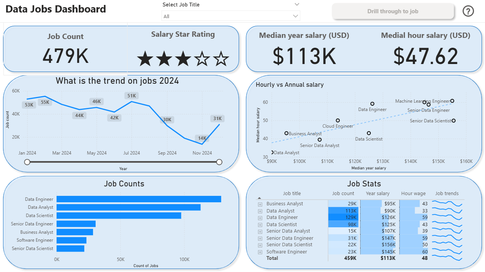

# Data Jobs Dashboard (Power BI)

## Introduction
This dashboard analyses a real-world dataset of **2024 data-related job postings** (titles, salaries, and locations). It consolidates scattered information into a single, interactive view to explore **market trends** and **compensation** across roles.

Built in Power BI, the report demonstrates practical skills such as **drill-through navigation**, **field parameters**, **smart tooltips**, and clear KPI design, supported by a tidy data model. The focus is on producing an interpretable, well-structured analysis rather than a business pitch.

## Skills showcased

- **Data modelling & setup:** loaded and organised the 2024 job-postings dataset; set data types, basic relationships, and number formats (currency, whole number, percent).
- **Measures:** created report measures using Power BI’s built-in aggregations (e.g., job count, median annual salary, median hourly salary, and simple trend indicators).
- **Core visuals:** column and bar charts for comparisons; line/area charts for monthly trends; scatter plot with a trend line for salary vs demand.
- **Tabular reporting:** matrix/table with conditional formatting and **sparklines** to show micro-trends by role.
- **Geospatial visuals:** map views to display the distribution of postings across countries.
- **KPI cards:** headline figures for total jobs and typical pay (annual and hourly).
- **Interactivity:** slicers for role and other filters; **drill-through** from the overview to a role-detail page; **zoom slider** on continuous axes.
- **Layout & design:** consistent number formats, clear titles and labels, restrained palette, and spacing for readability on standard screens.

## Dashboard overview

### Page 1: Overview

A concise, at-a-glance view of the data-jobs market. It presents core KPIs—**total job count**, **median annual/hourly pay**, and **top job titles**—so you can quickly grasp current trends. Use the slicers to focus the view; selecting a role enables drill-through to the detail page.

### Page 2: Job Title Drill-through

The detail view for a single role. Drilling through from the overview opens this page with focused metrics: **salary levels** (annual and hourly), **work-from-home share**, **no-degree mentions**, **top platforms**, and a **map of job locations**. Use the back button to return to the main dashboard.

## Conclusion

This dashboard demonstrates how Power BI can turn job-posting data into a clear, interactive analysis. It highlights core skills—data modelling, measures, thoughtful visual design, slicers, and drill-through—to surface market trends and pay patterns in a concise, inspectable format.

